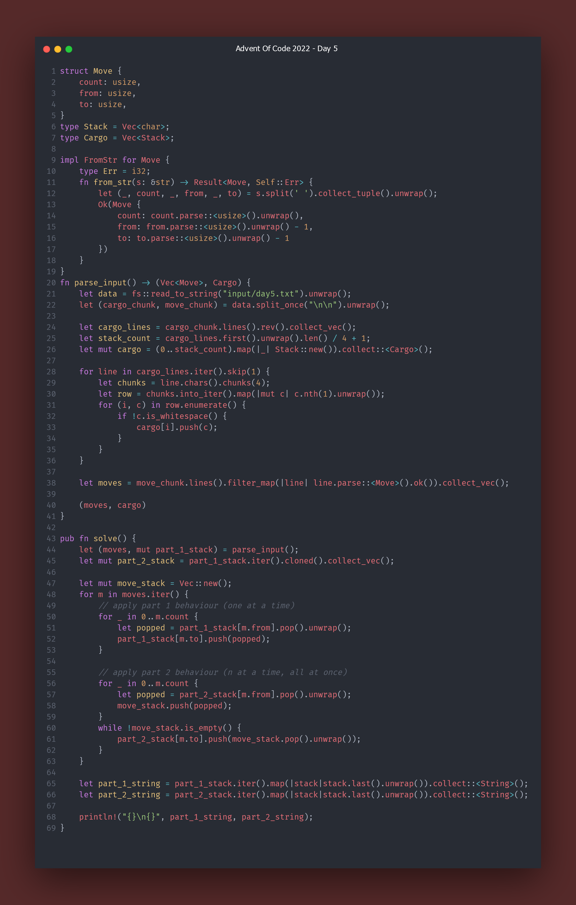

# Advent Of Code 2022 Solutions

Solutions written in Rust. Screenshots taken using [rayso](https://ray.so/) and [carbon](https://carbon.now.sh/).

I have multiple styles of solutions for many of the tasks. For example, for Day 1, I took a Progressive-Scan approach, and then completed the task in a more Functional way using iterators directly.

## Day 1
### Functional

Other Solutions

### Progressive Scan

## Day 2
### Functional

## Day 3
### Functional (and ugly)

For the sake of making a "consise" solution to this task, I converted my <a href="src/day3.rs#L75">cleaner solution</a> to the following approach.

## Day 4
### Functional

## Day 5
### Imperative

The imaged solution here is altered a bit to make it small enough to fit in the image realistically. You can see the full implementation <a href="src/day5.rs#L86">here</a>.

